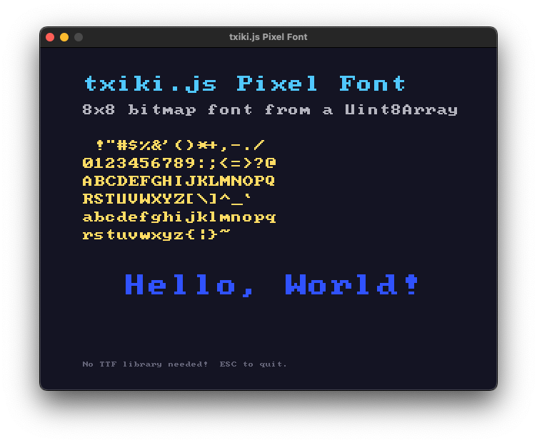

# SDL3 bindings

High-level [SDL3](https://wiki.libsdl.org/SDL3) bindings built on top of the `tjs:ffi` module.

Currently the core SDL, Image and TTF libraries are covered, mostly focusing on 2D rendering.

## Prerequisites

Install the SDL3 shared libraries for your platform:

- **macOS**: `brew install sdl3 sdl3_image sdl3_ttf`
- **Linux**: build from source or use your package manager
- **Windows**: place `SDL3.dll`, `SDL3_image.dll`, `SDL3_ttf.dll` in your PATH

## Quick start

```js
import { SDL, Window, EventType } from './src/index.js';

SDL.loadLibrary();
SDL.init();

const window = new Window('Hello', 800, 600);
const renderer = window.createRenderer();

let running = true;

while (running) {
    for (const event of SDL.pollEvents()) {
        if (event.type === EventType.QUIT) {
            running = false;
        }
    }

    renderer.setDrawColor(0, 0, 0);
    renderer.clear();
    renderer.setDrawColor(255, 100, 50);
    renderer.fillRect(100, 100, 200, 150);
    renderer.present();
}

renderer.destroy();
window.destroy();
SDL.quit();
```

## Examples

The `examples/` directory contains a few example applications:



## Acknowledgements

These bindings were heavily inspired by the [Deno SDL2 bindings by littledivy](https://github.com/littledivy/deno_sdl2).

